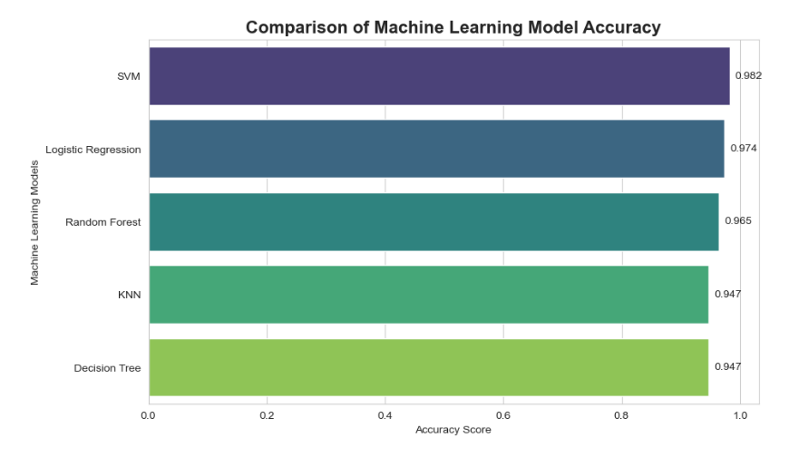

# Breast Cancer Diagnosis Prediction Using Machine Learning

## Project Overview
This project applies machine learning techniques to predict whether a breast tumor is **malignant** or **benign** using the Wisconsin Diagnostic Breast Cancer (WDBC) dataset. The goal is to evaluate multiple classification algorithms and determine which model performs best for this medical diagnosis task.

Machine learning models can assist medical professionals by identifying patterns in clinical data and improving early detection of breast cancer.

---

## Dataset

The dataset used in this project is the **Wisconsin Diagnostic Breast Cancer (WDBC) dataset**.

It contains measurements computed from digitized images of breast cell nuclei obtained from fine needle aspirate tests.

Dataset characteristics:

- **Number of samples:** 569
- **Number of features:** 30 numerical features
- **Target variable:** Diagnosis (Malignant or Benign)

Feature groups include:

- Mean values of cell measurements
- Standard error values
- Worst (largest) measurements

Examples of features:

- Radius
- Texture
- Perimeter
- Area
- Smoothness
- Concavity
- Symmetry

---

## Project Workflow

The project follows a typical machine learning pipeline:

1. Data loading
2. Data preprocessing
3. Exploratory data analysis
4. Feature scaling
5. Training machine learning models
6. Model evaluation
7. Performance comparison

---

## Data Preprocessing

Several preprocessing steps were applied before training the models:

- Converting the **diagnosis column** from categorical labels (M/B) to numerical values (1/0)
- Removing the **ID column** because it does not contribute to prediction
- Splitting the dataset into **training and testing sets**
- Applying **StandardScaler** to normalize feature values

Feature scaling ensures that all variables have similar ranges and improves the performance of certain algorithms.

---

## Machine Learning Models Used

Five classification algorithms were implemented and compared:

- Logistic Regression
- K-Nearest Neighbors (KNN)
- Decision Tree
- Random Forest
- Support Vector Machine (SVM)

Each model was trained on the training dataset and evaluated using the testing dataset.

---

## Model Evaluation

Model performance was evaluated using:

- **Accuracy score**
- **Confusion matrix**
- **Classification report**
- **Cross-validation**

These metrics help determine how well each model classifies tumors.

---

## Results

The accuracy results obtained were approximately:

| Model | Accuracy |
|------|------|
| Logistic Regression | ~97% |
| K-Nearest Neighbors | ~94% |
| Decision Tree | ~93% |
| Random Forest | ~96% |
| Support Vector Machine | ~98% |

The **Support Vector Machine (SVM)** model achieved the highest accuracy and showed the best performance on the dataset.

---

## Visualizations

Several visualizations were generated to better understand the dataset and model performance:

- Class distribution plot
- Correlation heatmap
- Model accuracy comparison
- Confusion matrix

Example visualization:

---

## Technologies Used

- Python
- Pandas
- NumPy
- Matplotlib
- Seaborn
- Scikit-learn
- Jupyter Notebook

---

## Project Structure
